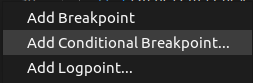
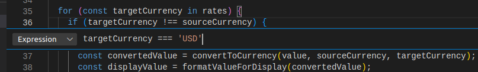
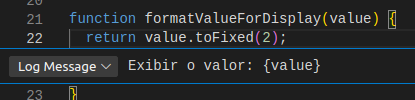

# Debugger manual

Depurador interno do Node (`inspect`)

```bash
node inspect <your_script>.js
```

`--inspect` permitir que clientes de depuração se conectem ao processo do Node (`-brk` interrompe a execução do código logo antes do início do seu código)

```bash
node --inspect-brk script.js
```

> o Node executa no host 127.0.0.1 na porta 9229, podemos alterar `--inspect=HOST:PORT`

Comandos:

- **cont** ou **c**: continuar. Continua a execução até o ponto de interrupção seguinte ou até o fim do programa.

- **next** ou **n**: Prosseguir para o próximo passo. Executa a próxima linha de código no contexto atual.

- **step** ou **s**: Intervir. O mesmo que next, exceto que, se a próxima linha de código for uma chamada de função, vai para a primeira linha do código da função.

- **out** ou **o**: sair. Se o contexto de execução atual estiver dentro do código de uma função, execute o código restante dessa função e volte para a linha de código em que essa função foi inicialmente chamada.

- **restart** ou **r**: reiniciar. Reinicia o programa e pause a execução antes do início de seu código.

- **setBreakpoint()** ou **sb()**: adicionar um ponto de interrupção na linha atual.

- **setBreakpoint(N)** ou **sb(N)**: adicionar um ponto de interrupção no número de linha N.

- **clearBreakpoint('myscript.js', N)** ou **cb('myscript.js', N)**: limpe o ponto de interrupção no arquivo myscript.js no número de linha N.

- **list(N)**: liste seu código-fonte com N linhas antes e depois do ponto de execução atual.

- **exec EXPR**: avalie uma expressão dentro do contexto de execução atual. Esse comando é útil para ajudar você a obter informações sobre o estado atual. Por exemplo, você pode obter o valor de uma variável chamada i usando exec i.

Exibir os valores das variáveis i e sum:

```bash
exec [i, sum]
```

Para sair: execute CTRL+D ou digite

```bash
.exit 
```

Controlar a execução:


- **Continuar ou pausar a execução**. Se a execução for pausada, ela continuará até que o próximo ponto de interrupção seja atingido. Se o programa estiver em execução, o botão alternará para um botão pausar que você pode usar para pausar a execução. (igual ao comando **cont**)

- **Contornar**. Executa a próxima instrução de código no contexto atual (igual ao comando **next** no depurador interno).

- **Intervir**. Semelhante a Contornar, mas se a próxima instrução for uma chamada de função, siga para a primeira instrução de código dessa função (a mesma que o comando **step**).

- **Sair**. Se você estiver dentro de uma função, execute o código restante dela e volte para a instrução após a chamada de função inicial (o mesmo que o comando **out**).

- **Reiniciar**. Reinicie o programa desde o início.

- **Parar**. Encerre a execução e saia do depurador.

Para seguir passo a passo, tecle em **contornar**


Quando houver uma interrupção (breakpoint) tecle no controle **intervir** para entrar na função


Adicionar um ponto de interrupção condicional:



Informe a condição que vai levar ao ponto de interrupção:



Adicionar um Logpoint, ao passar pelo ponto será executada a expressão `{expression}`



@autor [Diorgenes Morais](https://github.com/diorgenesmorais)

@version 1.0.0
