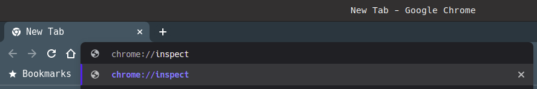

# Mini manual of the developer

## Linux commands every sysadmin should know

- curl -I -s ip/hostname of the server

(-I) Fetch the HTTP-header only, quietly (-s)

```bash
curl -I -s 179.108.248.70
```

- pipe the output of a JSON file into the python -m json.tool command.

```bash
curl localhost:8080/pessoas | python -m json.tool
```

- Use tail -f to follow Apache HTTP logs and see the requests as they happen.

tail -f /var/log/apache2/access.log
or you can also use tail to see the last 5 lines of the file with the -n option.

```bash
tail -n 5 /var/log/apache2/access.log
```

- ps shows process status.

For even more legibility, use ps and pipe it to grep.

```bash
ps -ef | grep tomcat
```

- env

env allows you to set or print the environment variables.

```bash
env
```

- netstat

Using netstat -tulpn shows that Apache already uses port 80 on this machine

```bash
sudo netstat -tulpn
```

- ip address show lo

Using ip address shows that the IP address of the eth0 interface is 127.0.0.1

```bash
ip address show eth0
```

- lsof lists the open files associated with your application.

```bash
lsof -i tcp
```

- You can use df (display free disk space) to troubleshoot disk space issues.

```bash
df -h
```

- you can use du with the -h (human-readable) option and the -s option for the total size.

```bash
du -sh /home/*
```

[source](https://opensource.com/article/17/7/20-sysadmin-commands)
@co-author [Rosemary Wang](https://opensource.com/users/joatmon08)

## Two ways to debug JavaScript project

1. Javascript debug terminal.

    Use VS code javascript debug terminal to debug using jest

    

    click the debug icon and in 'Javascript debug terminal'

    will open a terminal like this, where you must run the test command

    

2. Use Chrome DevTools to debug Jest tests.

    First, Node debugger in your project:

    ```bash
    # node --inspect-brk <path to jest.js> --runInBand <path to your test file>
    ```

    Example

    ```bash
    node --inspect-brk ./node_modules/jest/bin/jest.js --runInBand src/handleString.test.js
    ```

    Then, you can open the Google Chrome browser, and type in the address bar:

    

    Now click the inspect link under "Remote Target" to open Chrome DevTools.

    

    Add folder to workspace

    

    adding the source code folder to the workspace in chrome-devtools.

    And then you can open your script files and set the breakpoints:

    

@autor [Diorgenes Morais](https://github.com/diorgenesmorais)

@version 2.0.0
