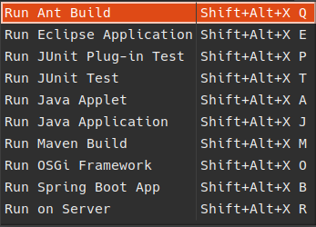
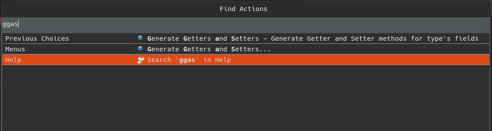

# Atalhos para produtividade com Eclipse

> Não é exclusivo, mas são atalhos comprovados usando Ubuntu

Variable rename:

`Alt + Shift + R`

Open quick fix (pop-up com atalhos rápidos para criar Class, Enum, Interface...):

`Ctrl + 1`

Open Type (pesquise e abra arquivos tipo classes, enums, interfaces...):

`Ctrl + Shift + T`

Open Resource (pesquise a abra arquivos de qualquer tipo):

`Ctrl + Shift + R`

Navigate between windows (abre um pop-up com uma lista de todas as janelas abertas - é possível filtrar):

`Ctrl + E`

Switch between windows (sempre vai no último aberto):

`Ctrl + F6` ou `Ctrl + Fn + F6`

Organize imports:

`Ctrl + Shift + O`

Organize indetation:

`Ctrl + Shift + F`

Delete row:

`Ctrl + D`

Run As (executar o JUnit):

`Alt + Shift + X T`

* Ao tecla a sequência `Alt + Shift + X` irá abrir um pop-up... Depois basta teclar a letra representante:

> 

Open 'Quick Access' ou 'Find Actions':

`Ctrl + 3`

* Depois digite as iniciais:

> 
