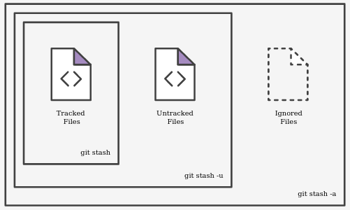

# Git

> ## Mini manual de referência

Configuração inicial (básica)

>```bash
>git config --global user.name "Seu nome"
>git config --global user.email seu.email.git@gmail.com
>git config --global core.editor vim
>```

Script que completa os comandos do Git e demonstra se estamos em um repositório Git e em qual branch

> Colocar este script no arquivo .bashrc ou .zshrc (ou qualquer variante disso)

```bash
# Configuração acrescentada por mim
if [ -f /etc/bash_completion.d/git ]; then
    . /etc/bash_completion.d/git
fi
GIT_PS1_SHOWDIRTYSTATE=true
PS1=$PS1'$(__git_ps1 "(%s)")\$ '
```

> Depois de inserir o script, execute

```bash
source ~/.bashrc
```

Transformar diretório atual em repositório Git

```bash
git init
```

Listar os arquivos que são controlados pelo Git

```bash
git ls-files
```

Ver status dos arquivos no repositório

```bash
git status
```

Criar uma nova branch e já continuar trabalhando (atalho: cria e muda p/ nova branch)

```bash
git checkout -b nome_da_branch
```

Deletar branch localmente

```bash
git branch -D branch_name
```

Deletar branch remota

```bash
git push origin --delete branch_name

# or
git push origin :branch_name
```

Antes de fazer um merge, devemos atualizar a branch com a remota

```bash
git pull
```

Após o git pull, se houver atualização (remota) podemos (devemos) atualizar a branch develop com base na master

```bash
git rebase master develop
```

Mudar para outra branch

```bash
git checkout nome_da_branch_que_quer_ir
```

Atualizar a branch <master> com a branch <develop>

```bash
git merge develop
```

Desfazer uma alteração em um determinado arquivo que não foi adicionado (antes do git add)

```bash
git checkout -- nome_do_arquivo
```

Refazer o conteúdo do último commit (altere o arquivo para o mesmo commit)

```bash
git add .
git commit --amend
```

> **Alterar a mensagem mais recente do commit**
>
> git commit --amend

Retirar um arquivo da área de seleção (do estado de pronto para ser comitado após o git add)

```bash
git reset HEAD nome_do_arquivo
```

Desfazer o último commit voltando para o estado modificado (**modified**)

```bash
git reset HEAD^
```

Reverter um commit (ele desfaz o commit do hash informado e NÂO desfaz o log - ideal para master)

```bash
git revert <hash_of_commit>
```

Deletar branch que não vai mais usar (local)

```bash
git branch -d nome_da_branch
```

Deletar branch remota

```bash
git push origin :nome_da_branch
```

Criar tag (local)

```bash
git tag -a v1.0.1 -m "anotação"
```

Enviar tag para repositório remoto

```bash
git push origin master --tags
```

Deletar tag (local)

```bash
git tag -d v1.0.1
```

Deletar tag no repositório remoto

```bash
git push origin :v1.0.1
```

Exibir as branchs local

```bash
git branch [--list]
```

Exibir as branchs remotas

```bash
git branch -r
```

Criar uma branch local e ligar a remota

```bash
git branch -t <nome_da_branch> origin/nome_da_branch
```

Adicionar um arquivo para ser rastreado pelo Git (talvés seja necessário usar sudo)

```bash
git add full_filename

# or use . to all:
git add .

# or use -A to all (mais completo):
git add -A
```

Comitar os arquivos do repositório local

```bash
git commit -m "Mensagem explicativa"

# or add all changes and commit, but new files you have not told Git about are not affected.
git commit -a
```

Verificar histórico das alterações comitadas no repositório

```bash
git log
```

Exibir autor e quem fez o commit

```bash
git log --pretty=full
```

Mostrar o que foi alterado nos commits

```bash
git log -p
```

Além do log, mostrar a lista dos arquivos alterados

```bash
git log --stat
```

Apontar o seu projeto para o GitHub (https)

```bash
git remote add origin https://github.com/conta_no_github/nome_do_projeto.git
```

Apontar o seu projeto para o GitHub (ssh)

```bash
git remote add origin git@github.com:username/project_name.git
```

Enviar as alterações para o GitHub

```bash
git push -u origin master
```

> Se usou **-u** no comando anterior, para enviar as alterações da próxima vez, use:
>
>```bash
>git push
>```

Clonar (cópiar projeto [directory to directory]), em um diretório
(this command will create a directory with the name of the project)

```bash
git clone https://github.com/conta_no_github/nome_do_projeto.git
```

Se houver uma cópia do projeto localmente, para atualiza-lo

```bash
git pull origin master
```

Remover arquivos que já foram submetidos de serem monitorados localmente após serem colocados na lista do .gitignore

```bash
git rm --cached filename
```

Remover diretório de serem monitorados

```bash
git rm -r --cached dir/
```

Remover todos (.) os arquivos da lista do git local de forma recursiva

```bash
git rm -r .
```

Listar as branch

```bash
git branch
```

Alterar de Branch

```bash
git checkout <branch-name>
```

Salvar as modificações numa área temporária (stash) para aplicar depois

```bash
git stash
```



Colocar uma descrição e salvar na stash (ficar melhor para identificar)


```bash
git stash push -m "breve descrição"
```

Listar o stash

```bash
git stash list
```

Aplicar o último stash

```bash
git stash pop
```

Aplicar um stash específico

```bash
git stash apply stash@{0}
```

Aplicar criando junto uma branch. (**mesmo jeito do pop, retira o stash da pilha**)

```bash
git stash branch <branchname> [<stash>]
```

Apagar o stash

```bash
git stash drop
```

Inspecionar um remoto (git remote show [nome-remoto]

```bash
git remote show origin
```

Alterar url de um repositório remoto

```bash
git remote set-url origin https://github.com/conta_no_github/nome_do_projeto.git
```

Ver as últimas alterações adicionadas

```bash
git diff --staged
```

Comparar (diferença) arquivo do working directory

```bash
git diff origin/master
```

Estando na branch master, comparar o que foi alterado no develop

```bash
git diff develop origin/master
```

Listar os nomes de arquivos modificados

```bash
git diff --name-only
```

Ver a diferença de arquivo e entre branch

```bash
git diff branch1..branch2 -- file_name
```

Descobrir quem realizou as alterações em um arquivo linha a linha (use "q" para sair)

```bash
git blame filename
```

Empacotar o repositório local em .ZIP

```bash
# verbose
git archive master --format=zip --output=package_name.zip

# forma simples
git archive branch_name -o package_name.zip
```

### Note

> Um exemplo de fluxo de trabalho
>
> * Crie uma branch **develop**
>
> git checkout -b develop
>
> * Crie uma **feature** a partir de develop
>
> git checkout -b my-feature develop
>
> *Após finalizar a feature:*
>
> * mude para develop;
>
> git checkout develop
>
> * faça um merge;
>
> git merge --no-ff my-feature
>
> * delete a branch 'my-feature'
>
> git branch -d my-feature.
>
>
> Normalmente usa-se este fluxo, porque não usar o [git flow](https://github.com/diorgenesmorais/Mini-manuais/blob/master/mm_git_flow.md)?

#### Dicas

> Como acessar o manual referente a um comando. Exemplo: Ver Git manual checkout

```bash
git checkout --help
```

> Como reverter o commit inicial - alterar o primeiro commit

```bash
# alterar para o estado de não comitado
git update-ref -d HEAD
```

```bash
# remover o arquivo que não deveria ter sido comitado
git rm --cached <file>
```

```bash
# comitar
git commit
# atualizar repositório remoto
git push origin master --force
```

----------------------------

#### Plugins para vscode

* Git history

* GitLens

#### Authors

* [**Diorgenes Morais**](https://github.com/diorgenesmorais/blob/master/mm_git.md)
